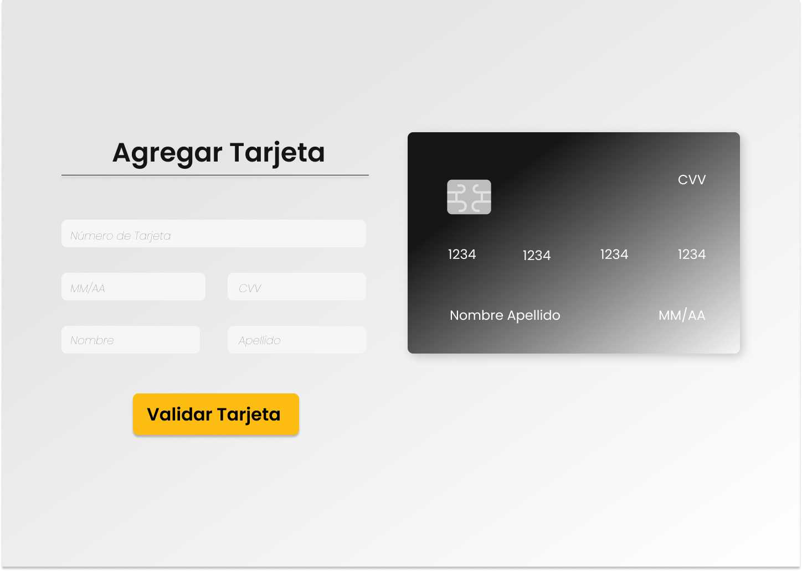
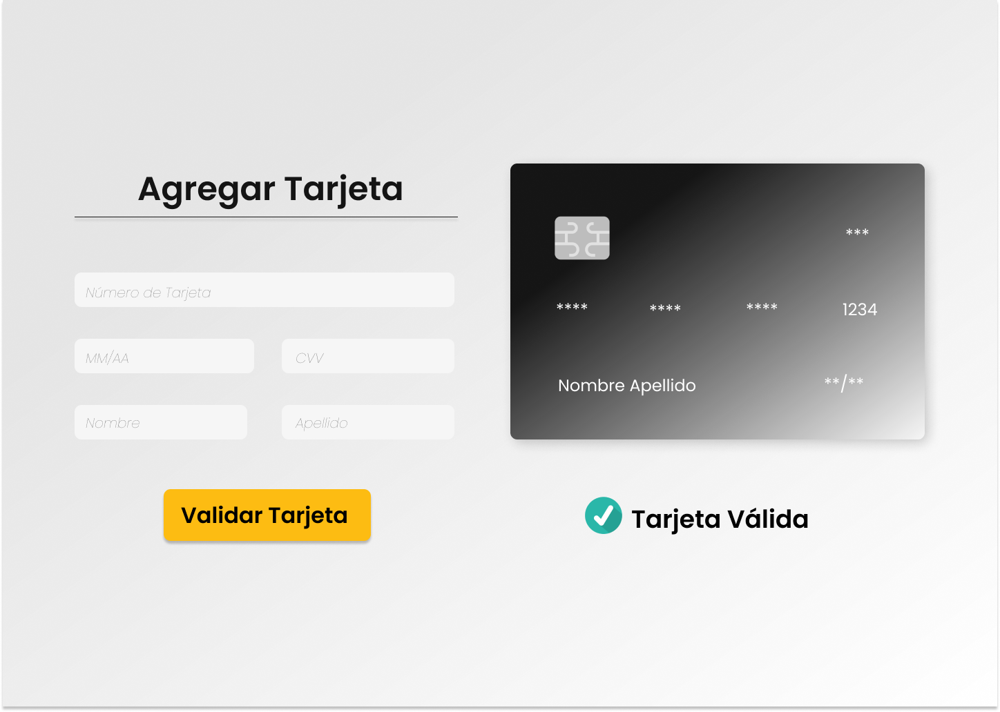
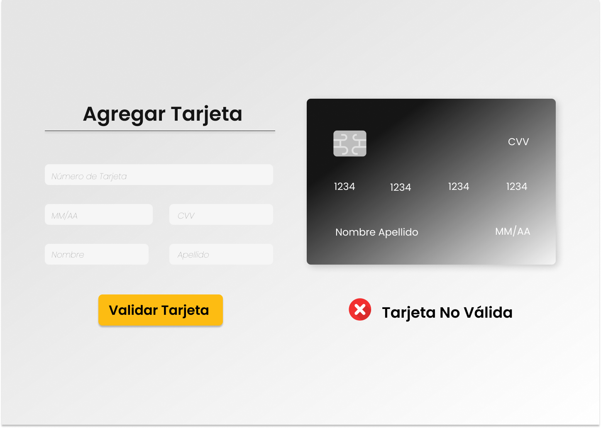

# Card Validation

Desarrollé una aplicación web que permite al usuario validar el número de una tarjeta de crédito. Además, si la tarjeta es válida cuenta con la funcionalidad de ocultar todos los dígitos de la tarjeta exceptuando los últimos 4. La temática está desarrollado para una ecommerce de delivery de alimentos.

## Explicar quiénes son los usuarios

El perfil de usuario es:
Ubicación: Capitales de los paises Latinoamericanos
Edad: 18 a 35 (incluye parte de la generación millenials y Z)
Género: indistinto
Sector económico: Medio
Segmentación psicográfica:
Estilo de vida: Sedentario y tecnológico
Comportamiento: Consumidor de e-commerce

## Objetivos en relación al producto

Brindar confianza para ingresar los valores solicitados en la web.
Llamar a la acción de validar tarjeta y familiarizar con los colores de ecommerce reconocidos (rappi, promart)
Generar seguridad del uso de datos.
Explicar cómo el producto soluciona los problemas/necesidades de dichos usuarios.
Brinda confianza a través de una web con colores neutros.
Uso del tono amarillo naraja que evoca al llamado de acción del botón validar tarjeta  y familiarizar al usuario con los ecommerce mas populares.
Generar seguridad a través de la protección de datos ocultando la información de su tarjeta.

## Luego colocarás la foto de tu primer prototipo en papel.

### Agregar un resumen del feedback recibido indicando las mejoras a realizar.

Cambiar el formato de la fecha del imput Date.
Refrescar la web para ocultar los datos ingresados.

## Imagen del prototipo final.

## Imagen final de mi proyecto

